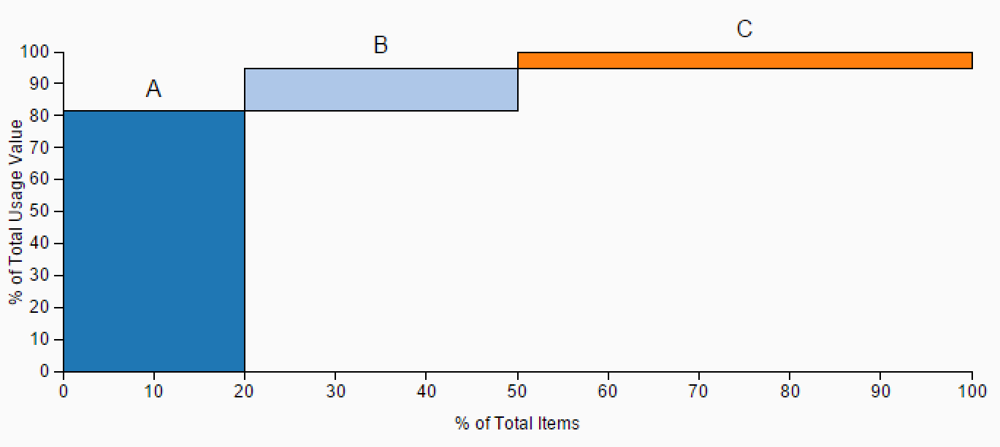

#ABC Analysis
by [Denzale Reese](https://people.sap.com/denzalereese)

##Files
<ul>
	<li>
		SAP Lumira extension: <code>sap.viz.ext.abcanalysis.zip</code>
	</li>
	<li>
		Sample data: <code>abc-analysis.csv</code> or <code>abc-analysis2.csv</code>
	</li>
	<li>ABC Analysis excel file (for you to create your own dataset!): 	<code>create-abc-analysis.xlsx</code>
	<li>
		SAP Lumira file: <code>abc-analysis.lums</code>
	</li>
</ul>

##Data
####abc-analysis.csv or create-abc-analysis.xlsx
<ul>
	<li>Measures
		
(any)

	</li>

	<li>Dimensions (value, classification)
		
usage value

		
classification

	</li>
</ul>

####abc-analysis2.csv

<ul>
	<li>Measures
		
(any)

	</li>

	<li>Dimensions (value, classification)
		
value

		
category

	</li>
</ul>

##Resources
<ul>
	<li>Blog post: "Modifying SAP Lumira Extensions: ABC Analysis"</li>
</ul>

