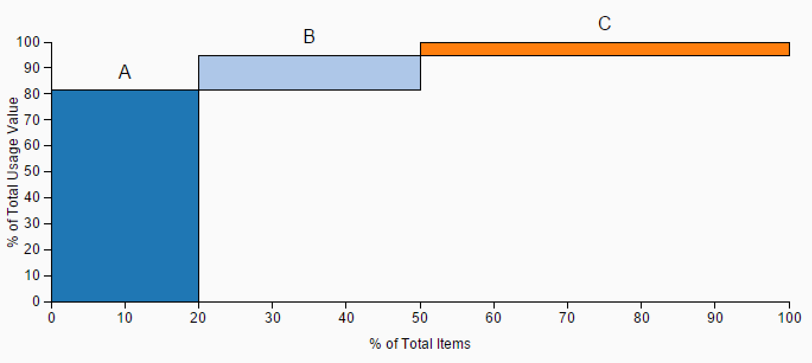

#ABC Analysis
by [Wolf (Denzale) Reese](https://people.sap.com/denzalereese)

ABC Analysis is an inventory categorization technique that divides items into 3 categories: A, B, and C. A items are the most significant: making up the top ~70-80% of the inventory value and only ~10-20% of the total items. B items make up ~15-25% of the value and ~30% of the items, and C items are the least important: making up ~5% of the value and ~50% of the value. This technique allows managers to determine which inventory items should be tracked very closely, and which can be more loosely controlled

##Download

[ABC Analysis](https://github.com/denzalereese/lumira-extension-viz/raw/master/ABC_Analysis/sap.viz.ext.abcanalysis.zip)

##Files
<ul>
	<li>
		SAP Lumira extension: <code>sap.viz.ext.abcanalysis.zip</code>
	</li>
	<li>
		Sample data: <code>abc-analysis.csv</code> or <code>abc-analysis2.csv</code>
	</li>
	<li>ABC Analysis excel file (for you to create your own dataset!): 	<code>create-abc-analysis.xlsx</code>
		
Just add rows with the item’s id (if applicable), the item’s cost per unit, and the annual demand for the item. The Excel sheet will calculate the annual cost for each item, total cost of the inventory, and each item’s value as a percentage. Lastly, in the “classification” column you need to label each item as A, B, or C. To do this, I recommend sorting the table rows by descending usage value. Then label the items as close as you see fit to the criteria for each classification: A items making up the top ~70-80% of the value, B items the middle ~15-25%, and C items the bottom ~5%.

	<li>
		SAP Lumira file: <code>abc-analysis.lums</code>
	</li>
</ul>

##Data
####abc-analysis.csv or create-abc-analysis.xlsx
<ul>
	<li>Measures
		
(any)

	</li>

	<li>Dimensions (value, classification)
		
usage value

		
classification

	</li>
</ul>

####abc-analysis2.csv

<ul>
	<li>Measures
		
(any)

	</li>

	<li>Dimensions (value, classification)
		
value

		
category

	</li>
</ul>

##Resources

Blog Post -
[SAP Lumira Extensions: ABC Analysis](https://github.com/denzalereese/lumira-extension-viz/blob/master/ABC_Analysis/sap.viz.ext.abcanalysis.zip?raw=true)

