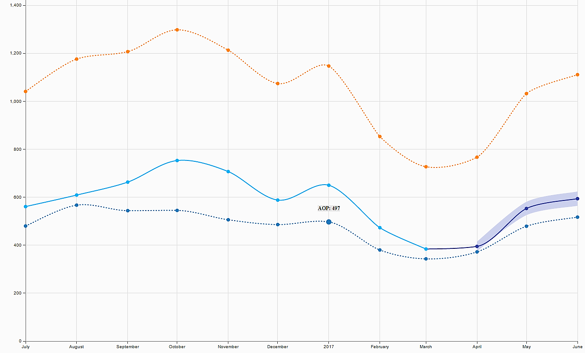
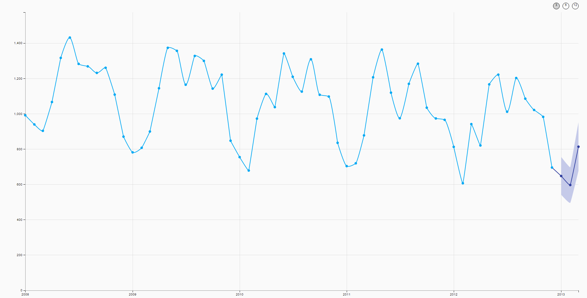

# Forecast (Single Confidence Interval)
by [Wolf (Denzale) Reese](https://people.sap.com/denzalereese)



This chart visualizes actuals and forecasts with a single confidence interval. A confidence interval provides a sense of how reliable the forecast is; it can show the level of uncertainty involved when making important decisions based on the prediction.

**Note**: The chart does not calculate the forecast itself, this would need to be produced in a predictive/statistical tool (AFL PAL, Predictive Analysis, InfiniteInsight, R, SAS, SPSS, etc.). This extension visualizes the results with the appropriate confidence interval.


Special S/O to [Jay Thoden van Velzen](https://people.sap.com/jay.thodenvanvelzen) who created the first version of this extension. This version builds on his great work with additional features like tooltips, the option to add extra measure lines, and filtering between 3-6-12 month forecasts (for datasets that include it, pictured below).




## Download

[Forecast (Single Confidence Interval)](https://github.com/denzalereese/lumira-extension-viz/raw/master/Forecast_Single_Confidence_Interval/sap.viz.ext.forecastsingle.zip)

## Files
- SAP Lumira extension: ```sap.viz.ext.forecastsingle```
- Sample data: ```forecast_city.csv```
- SAP Lumira file: ```forecast-single-confidence.lums```

## Data
#### forecast_city.csv
- Measures (Measure, Lower, Upper, Extras)
	- Measure
	- PILower
	- PIUpper

- Dimensions (Date, Type)
	- YearMonthString
	- Type


