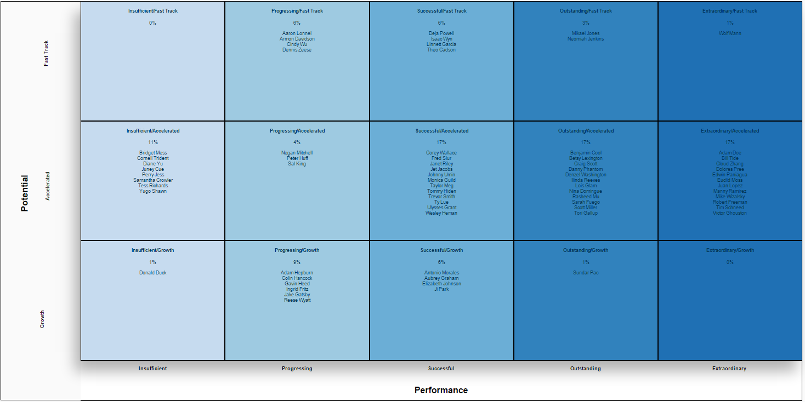

#Potential-Performance
by [Wolf (Denzale) Reese](https://people.sap.com/denzalereese)

This visualization extension for SAP Lumira is a chart that categorizes employees based on their performance level and potential for growth. It is built on top of an existing extension: [SWOT Analysis](https://github.com/SAP/lumira-extension-viz/tree/master/SWOT_Analysis) by [Wendy (Xin Win)](http://scn.sap.com/people/wendy.xin.wen) and showcases modifying open-source SAP Lumira visualization extensions to fit a specific need. 

Each box is a category made up of a performance metric from the X-axis, and potential metric from the Y-axis. The boxes contain a list of employees fitting the respective category, and the percentage of the total employees. Clicking on a box will display the information for just its category. 

##Download

[Potential-Performance](https://github.com/denzalereese/lumira-extension-viz/raw/master/Potential_Performance/sap.viz.ext.potentialperformance.zip)

##Files 
<ul>
	<li>SAP Lumira extension: <code>sap.viz.ext.potentialperformance.zip</code></li>
	<li>Sample data: <code>potential-performance.csv</code></li>
	<li>SAP Lumira file: <code>potential-performance.lums</code></li>
</ul>

##Data
<ul>
	<li>Measures (ID)
		
ID

	</li>
	<li> Dimensions (Employee, Potential, Performance)
		
Employee

		
Potential

		
Performance

	</li>
</ul>

##Resources
Blog Post -

[SAP Lumira Extensions: Potential-Performance]()